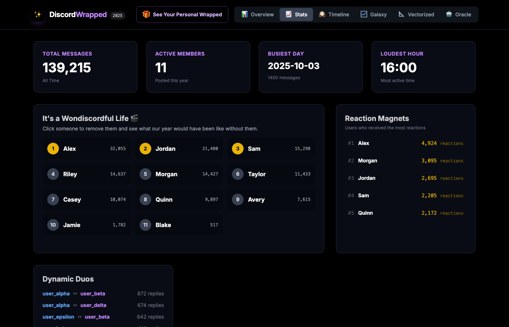
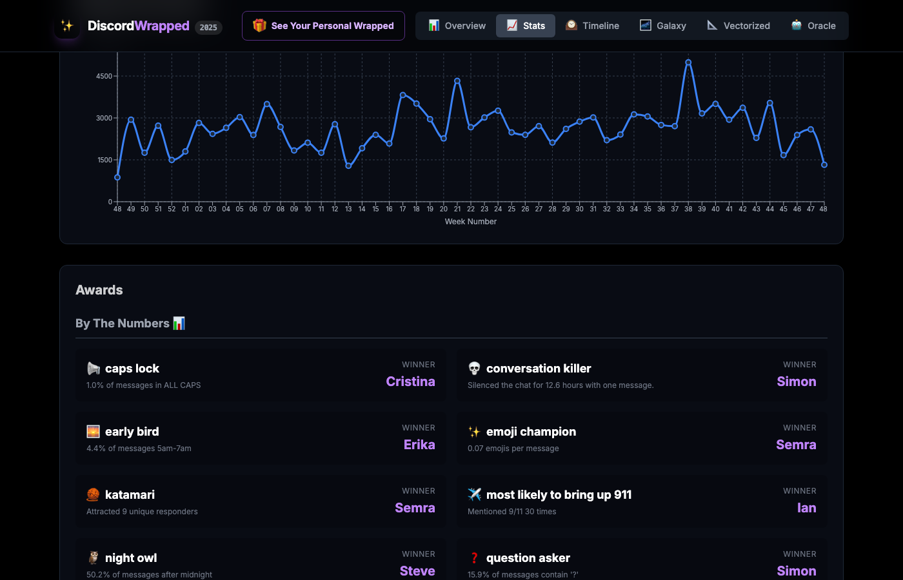
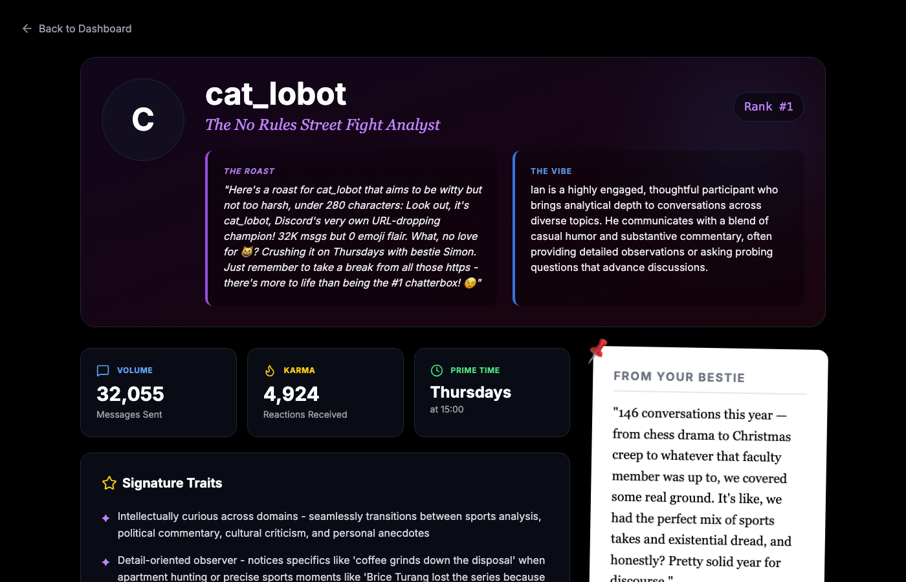
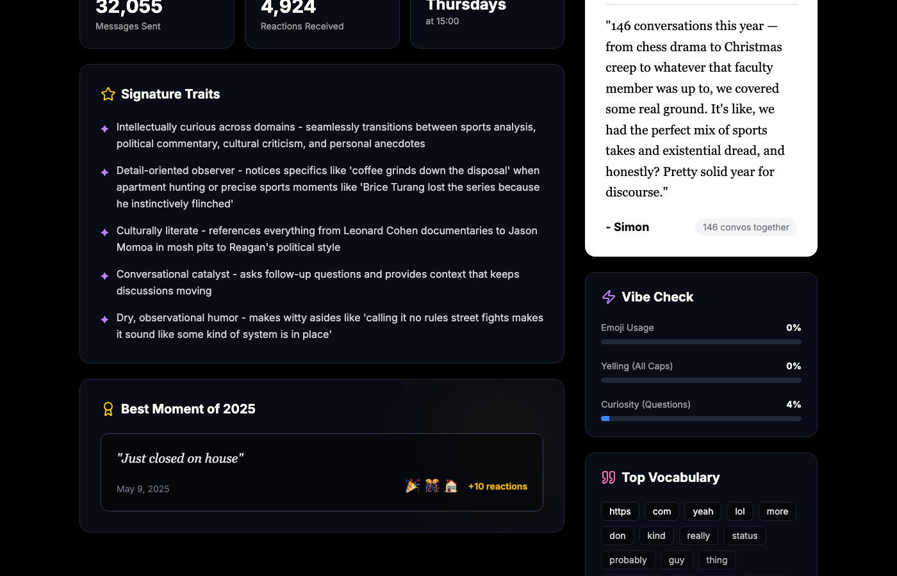
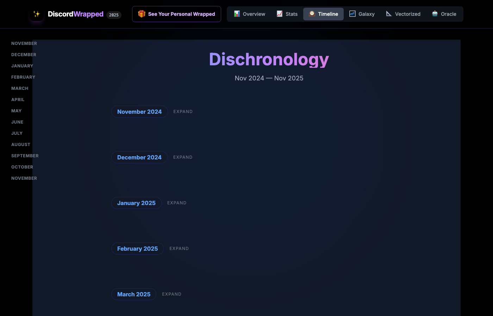
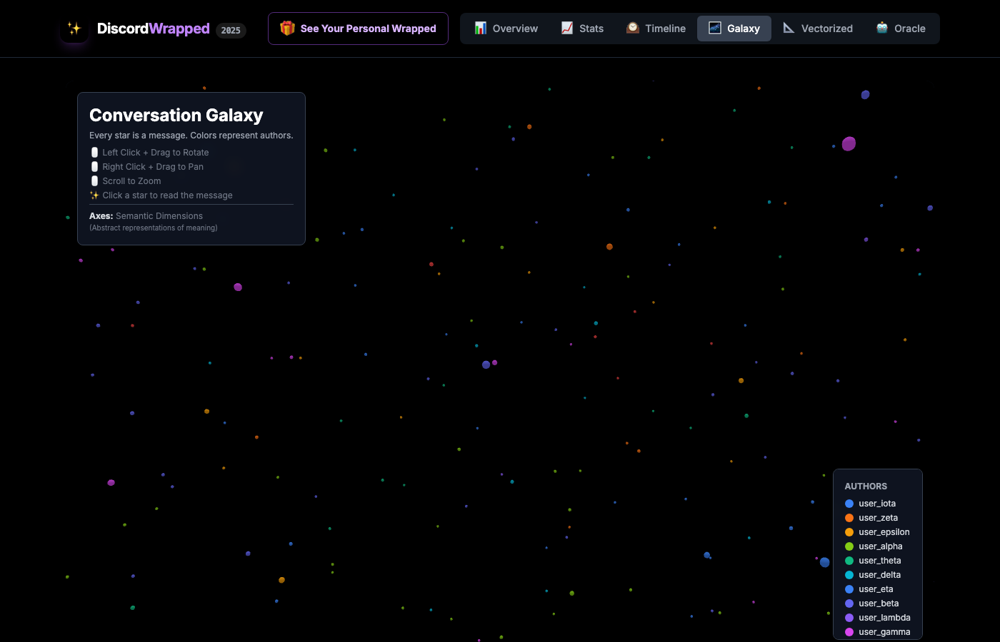

# Discord Wrapped

Last fall, I designed a completely LLM-driven, multimedia **Spotify Wrapped-style experience** for my Discord server. I wrote about it here: https://substack.com/home/post/p-185254067

Most of the fun of this is that it is a reflection, uniquely, of your server. So while the instructions below are very generic, the outputs should not be! 

The tool will help you analyze a year of chat data and generate personalized stats, awards, and insights for every member.

   



---

## Features

### Dashboard
The main hub — hero stats, leaderboards, reaction magnets, dynamic duos, and weekly activity chart all at a glance.


### Awards
Stat-based and LLM-powered awards, automatically computed from your chat data.



### Personal Profile Pages
Click any member to see their detailed stats, AI-generated personality read, personalized roast, best moment, vocabulary, and a yearbook-style message from their #1 conversation partner.




### Timeline
"Dischronology" — a month-by-month timeline of your server's year. Expand any month to see key moments and conversations.



### 3D Galaxy View
Every high-engagement message plotted in 3D space using sentence embeddings. Messages cluster by topic — hover to read, click to open in Discord.



### Story Mode
An animated, Spotify Wrapped-style slideshow that walks through your server's year — total messages, peak days, and a personalized card for every member.

### Oracle Chatbot
An AI that roleplays as your server's sentient consciousness. Ask it anything about your chat history — it has access to every message and can run queries on the fly.

---

## Awards

Awards are automatically computed from your server's data. No configuration needed.

### Stat-Based Awards
These are computed purely from message data — no API key required.

| Award | Emoji | What It Measures |
|---|---|---|
| **Night Owl** | 🦉 | Highest % of messages sent between midnight–5am |
| **Early Bird** | 🐦 | Highest % of messages sent between 5am–7am |
| **Emoji Champion** | 😂 | Highest emoji-per-message rate |
| **Question Asker** | ❓ | Highest rate of messages containing "?" |
| **Caps Lock Enthusiast** | 🔊 | Highest rate of ALL CAPS messages |
| **Conversation Killer** | 💀 | Sent the message that caused the longest silence |
| **Aproposter** | 🎲 | Most unpredictable posting patterns (highest variance) |
| **Katamari Damacy** | 🌍 | Attracted the most unique responders |

### LLM-Powered Awards
These use Claude to analyze conversation content. Requires an Anthropic API key.

| Award | Emoji | What It Measures |
|---|---|---|
| **Phoebe Bridgers Award** | 🎵 | Biggest emotional swings (emotional motion sickness) |
| **Bunny Lebowski Award** | 🎳 | Most nihilistic or cynical voice |
| **Alex Stephenson Award** | ☀️ | Most relentlessly positive (toxic positivity) |
| **Gen Z Award** | 📱 | Most Gen Z language and references |
| **Boomer Award** | 📰 | Most Boomer energy |
| **Taylor Swift Award** | 🎤 | Best at foreshadowing (hinting before revealing) |
| **2001: A Space Odyscord** | 🚀 | Most growth + old soul/youthful paradox |
| **Jeff Burroughs Award** | 🏷️ | Most tagged/mentioned by others |
| **Die Hard Award** | 💥 | Most Bruce Willis energy (resilient, sarcastic) |
| **Secretary of Holidays** | 🎄 | Most holiday mentions across the year |
| **HER Award** | 💻 | Most digital-to-real-life manifestations |

### Custom Awards
Define your own keyword-based awards in `config.yaml`:

```yaml
custom_keyword_trackers:
  - name: "Sports Fanatic"
    keywords: ["touchdown", "goal", "slam dunk", "home run"]
    emoji: "🏈"
  - name: "Foodie"
    keywords: ["recipe", "cooking", "restaurant", "delicious"]
    emoji: "🍕"
```

---

## Personal Stats

Every member gets a detailed profile with:

| Category | Metrics |
|---|---|
| **Volume** | Messages sent, rank, days active, longest streak, longest absence |
| **Timing** | Most active hour, most active day, night owl %, early bird % |
| **Style** | Avg message length, emoji rate, question rate, caps rate, edit rate |
| **Relationships** | Top 3 reply targets, top 3 replied by, mutual bestie |
| **Best Moment** | Most-reacted message with full context |
| **Vocabulary** | Top 20 signature words (unique to them vs the group) |
| **Personality** | AI-generated role, description, and signature traits |
| **Roast** | AI-generated personalized roast |
| **Partner Message** | Yearbook-style message from their #1 conversation partner |

---

## Server-Wide Analysis

| Feature | Description |
|---|---|
| **Leaderboards** | Top talkers, reaction magnets, most replied to, top repliers |
| **Dynamic Duos** | Top 10 conversation pairs by reply frequency |
| **Activity Heatmap** | Hour-by-weekday message density matrix |
| **Weekly Trends** | Message volume charted week by week |
| **Inside Joke Tracker** | Frequency timelines for recurring phrases (configurable) |
| **Conversation Patterns** | Topic pivots, callbacks, reply chains |
| **Timeline Disruption** | "It's a Wonderful Life" — what would the server look like without each person? |

---

## Quick Start

### 1. Create a Discord Bot

You need a bot to export your server's message history.

1. Go to the [Discord Developer Portal](https://discord.com/developers/applications)
2. Click **"New Application"** and give it a name (e.g., "Wrapped Bot")
3. Go to the **Bot** tab on the left sidebar
4. Click **"Reset Token"** and copy the token — save it somewhere safe
5. Under **Privileged Gateway Intents**, enable:
   - **Message Content Intent** (required to read messages)
   - **Server Members Intent** (optional but helpful)
6. Go to the **OAuth2** tab
7. Under **OAuth2 URL Generator**:
   - Check **`bot`** under Scopes
   - Check these permissions: **Read Message History**, **View Channels**
8. Copy the generated URL and paste it in your browser to invite the bot to your server

### 2. Get Your Server & Channel IDs

You'll need your Discord server's guild ID and channel IDs.

1. Open Discord and go to **User Settings > Advanced > Enable Developer Mode**
2. Right-click your **server name** (in the left sidebar) > **Copy Server ID** — this is your guild ID
3. Right-click each **channel** you want to analyze > **Copy Channel ID**

### 3. Clone & Configure

```bash
git clone https://github.com/pdxika/discord_wrapped_open.git
cd discord_wrapped_open

# Install Python dependencies
pip install -r requirements.txt

# Copy config templates
cp config.example.yaml config.yaml
cp .env.example .env
```

Edit **`.env`** with your tokens:
```env
DISCORD_BOT_TOKEN=your_bot_token_from_step_1
ANTHROPIC_API_KEY=your_anthropic_key    # Optional — skip for stats-only mode
```

Edit **`config.yaml`** with your server info:
```yaml
server:
  name: "My Server"
  guild_id: "123456789012345678"

# Map Discord usernames to display names
users:
  cooldude42: "Jake"
  xoxogamer: "Sarah"
  pizzalover99: "Mike"

# Channels to analyze (paste your channel IDs here)
channels:
  - 111111111111111111
  - 222222222222222222
  - 333333333333333333

export:
  days: 365

bot_persona_name: "ServerBot"
```

### 4. Export Your Messages

```bash
python export.py
```

This runs the Discord bot, which will:
- Connect to your server
- Download message history from all configured channels
- Save everything to `discord_messages.json`
- Automatically shut down when done

> **Note:** For large servers, this can take a few minutes. You'll see progress in the terminal.

### 5. Run the Analysis Pipeline

```bash
python run_pipeline.py
```

This runs all analysis scripts in the correct order:
1. **Basic stats** — message counts, peak hours, top emojis, word frequencies
2. **Patterns** — inside jokes, conversation callbacks, reply networks
3. **Awards** — computed from stats (Night Owl, Early Bird, etc.)
4. **LLM analysis** *(if API key set)* — personality reads, roasts, superlatives
5. **Embeddings** *(optional)* — 3D vector space visualization
6. **Final merge** — combines everything into the frontend data file

Options:
```bash
python run_pipeline.py --stats-only       # Skip LLM features
python run_pipeline.py --skip-embeddings  # Skip 3D visualization
```

### 6. Start the App

```bash
# Terminal 1: Start the backend
python server.py

# Terminal 2: Start the frontend
cd wrapped-frontend
npm install
cp .env.example .env
npm run dev
```

Open **http://localhost:5173** and enjoy your Wrapped!

---

## Configuration Reference

### `config.yaml`

| Field | Required | Description |
|---|---|---|
| `server.name` | Yes | Display name for your server |
| `server.guild_id` | Yes | Discord server (guild) ID |
| `users` | Yes | Map of `discord_username: "Display Name"` |
| `channels` | Yes | List of channel IDs to analyze |
| `export.days` | No | Days of history to export (default: 365) |
| `inside_jokes` | No | List of phrases to track over time |
| `custom_keyword_trackers` | No | Custom awards based on keyword usage |
| `bot_persona_name` | No | Name for the chatbot persona (default: "ServerBot") |
| `features.embeddings` | No | Enable 3D visualization (default: true) |
| `features.synesthesia` | No | Color association analysis (default: true) |
| `features.chatbot` | No | Interactive Oracle chatbot (default: true) |
| `features.bechdel` | No | Bechdel test analysis (default: false) |
| `llm.enabled` | No | Enable LLM features (default: true) |
| `llm.model` | No | Claude model to use (default: claude-sonnet-4-20250514) |

### `.env`

| Variable | Required | Description |
|---|---|---|
| `DISCORD_BOT_TOKEN` | Yes | Bot token from Discord Developer Portal |
| `ANTHROPIC_API_KEY` | No | Enables LLM features (roasts, personality reads, chatbot) |
| `PORT` | No | Backend server port (default: 5002) |

---

## Running Without an LLM

Don't have an Anthropic API key? No problem — you still get:

- All message statistics and visualizations
- Stat-based awards (Night Owl, Early Bird, Emoji Champion, etc.)
- Inside joke tracking and timelines
- Reply network analysis and Dynamic Duos
- Emoji and vocabulary breakdowns
- Personal stats for every member
- Story mode slideshow

You'll skip: personality reads, roasts, LLM-generated awards, the Oracle chatbot, and synesthesia colors.

Just leave `ANTHROPIC_API_KEY` blank in your `.env` and set `llm.enabled: false` in `config.yaml`.

---

## Pipeline Scripts (Advanced)

If you prefer to run scripts individually instead of using `run_pipeline.py`:

```bash
# Phase 1: Core analysis (can run in parallel)
python compute_basic_stats.py
python compute_patterns.py
python compute_all_awards.py
python compute_bechdel_test.py          # optional

# Phase 2: LLM analysis (needs Phase 1 outputs)
python compute_llm_analysis.py          # needs ANTHROPIC_API_KEY
python compute_final_llm_awards.py      # needs ANTHROPIC_API_KEY
python compute_synesthesia_colors.py    # needs ANTHROPIC_API_KEY
python compute_inside_joke_timeline.py  # needs patterns.json from Phase 1

# Phase 3: Embeddings (independent, needs sentence-transformers)
python compute_embeddings.py

# Phase 4: Vibe extraction (independent, needs ANTHROPIC_API_KEY)
python vibe_extractor.py discord_messages.json
python analyze_server_persona.py

# Phase 5: Merge everything
python merge_final_data.py
python merge_all_final_data.py
```

### Extra Dependencies for Embeddings

The 3D vector space visualization requires additional packages:

```bash
pip install sentence-transformers scikit-learn
```

> **Note:** `sentence-transformers` will download a ~100MB model on first run.

---

## Project Structure

```
discord_wrapped_open/
├── config.py                    # Config loader (all scripts import from here)
├── config.example.yaml          # Template — copy to config.yaml
├── .env.example                 # Template — copy to .env
├── export.py                    # Discord bot message exporter
├── run_pipeline.py              # One-command pipeline runner
├── server.py                    # Flask API backend
│
├── compute_basic_stats.py       # Core stats, word freq, emojis, awards
├── compute_patterns.py          # Inside jokes, callbacks, reply networks
├── compute_all_awards.py        # Statistical awards computation
├── compute_llm_analysis.py      # LLM personality reads & roasts
├── compute_final_llm_awards.py  # LLM-generated superlative awards
├── compute_synesthesia_colors.py# Color association analysis
├── compute_bechdel_test.py      # Bechdel test (optional)
├── compute_inside_joke_timeline.py # Inside joke frequency over time
├── compute_embeddings.py        # 3D vector space embeddings
├── analyze_server_persona.py    # Server chatbot persona generation
├── vibe_extractor.py            # Server voice/tone analysis
├── merge_final_data.py          # Intermediate data merge
├── merge_all_final_data.py      # Final data merge for frontend
│
└── wrapped-frontend/            # React + TypeScript frontend
    ├── src/
    │   ├── components/
    │   │   ├── Dashboard.tsx     # Main awards & stats dashboard
    │   │   ├── StoryMode.tsx     # Animated slide presentation
    │   │   ├── VectorSpace.tsx   # 3D conversation visualization
    │   │   ├── VectorSpace2D.tsx # 2D fallback visualization
    │   │   ├── UserPage.tsx      # Individual user stats pages
    │   │   └── MasterTimeline.tsx# Server timeline view
    │   └── api.ts               # API client
    └── package.json
```

---

## Troubleshooting

**"config.yaml not found"**
Copy the template: `cp config.example.yaml config.yaml` and fill in your values.

**Bot can't see channels**
Make sure the bot has **Read Message History** and **View Channels** permissions in each channel you want to export.

**Export is slow**
Large servers with 100k+ messages may take 5-10 minutes. The exporter shows progress every 1,000 messages.

**"ANTHROPIC_API_KEY not found"**
Either add your key to `.env` or set `llm.enabled: false` in `config.yaml` to skip LLM features.

**Frontend can't connect to backend**
Make sure the backend is running (`python server.py`) and the frontend's `.env` has the correct API URL (default: `http://localhost:5002/api`).

**Embeddings crash with OOM**
The embedding model needs ~2GB RAM. If your machine is tight on memory, set `features.embeddings: false` in `config.yaml`.

---

## License

MIT
